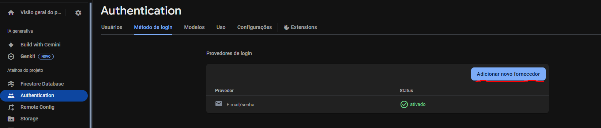
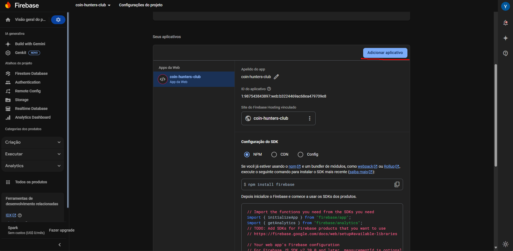
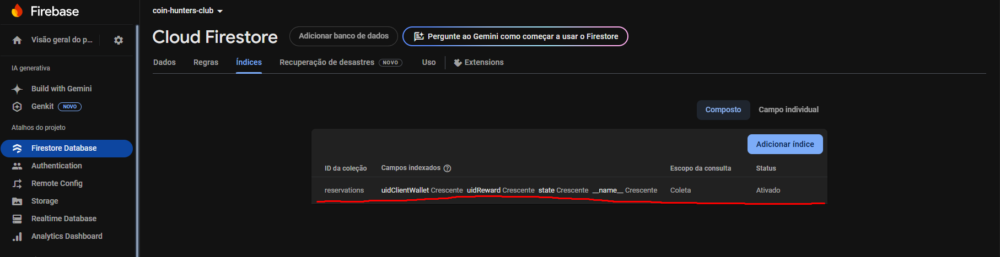

# Coin Hunters Club

Esse é o repositório do projeto Coin Hunters Club. Abaixo, estarão as
instruções de instalação e setup do projeto.

## Instale o Node.js

Acesse <a href="https://nodejs.org/pt/download">este site</a> e siga as instruções para instalar o Node.js

## Crie uma conta no Firebase

Acesse <a href="https://console.firebase.google.com/u/0/?hl=pt-br">o site do firebase</a> e crie um novo projeto.

Na aba de Autenticação (Authentication), habilite o método de login por email:


Nas configurações do projeto, adicione um novo aplicativo.

No código da imagem em cima, existirá um objeto chamado "firebaseConfig". Copie ele, pois será necessário adiante.

Crie uma nova firestore de testes (Não produção). No firestore recém criado, acesse a aba de índices, e adicione o índice mostrado abaixo:

Caso receba um erro durante o aplicativo sobre a falta de um índice requirido, isso significa que o índice foi adicionado incorretamente. Caso isso ocorra, basta clicar no link produzido pelo erro, que leva a uma página para adicionar o índice automáticamente.

## Instalando o projeto

1. Instale as dependências

   ```bash
   npm install
   ```

2. Crie um arquivo chamado "config.js", como mostrado pelo arquivo "config.example.js", e adicione lá dentro o objeto "firebaseConfig" adquirido nas configurações do projeto ao adicionar uma nova aplicação. O arquivo final deve ficar igual ao "config.example.js", mas com os dados preenchidos.

3. Inicialize o aplicativo

   ```bash
    npx expo start
   ```

Para utilizar a aplicação, existem três opções: Utilizar um emulador, utilizar a versão web, ou utilizar pelo celular com o aplicativo Expo Go.

### Emulador 
Para utilizar um emulador, é necessário ter o Android Studio instalado. Inicialize a emulação de um dispositivo móvel, e após o emulador estar rodando, pressionar "a" no terminal.

### Web
Para abrir a versão web, basta pressionar "w" no terminal.

### Expo Go
Para executar o projeto no celular pelo Expo Go, baixe o aplicativo pela app store. Em seguida, leia o código QR que foi mostrado no terminal com o aplicativo.